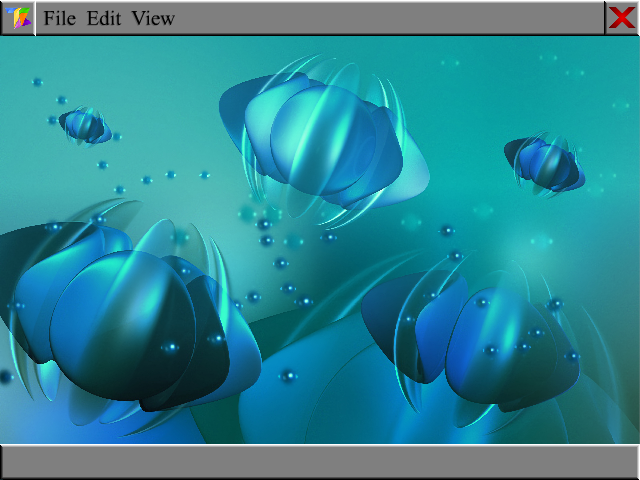

TaskOS is a operating system with its own kernel on top of Intel/AMDs x86_64 architecture.\
This is currently just plans, assembly files, some ANSI-C files, and that's about it.

Nothing here is compiled, so you would have to do that yourself, nor is anything in a bootable setting yet.

The image below shows what I plan the OS desktop to look like, and for now, the video manager will be rendered as a classic theme, so no glass as shown below yet.

Firefox is a trademark of the Mozilla Foundation and is not affiliated with or owned by me.
